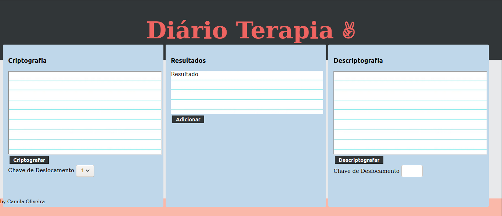
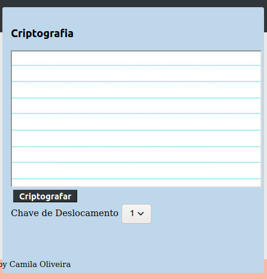
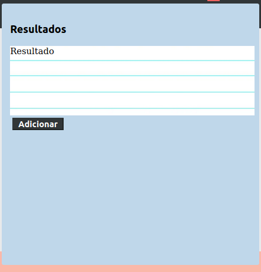
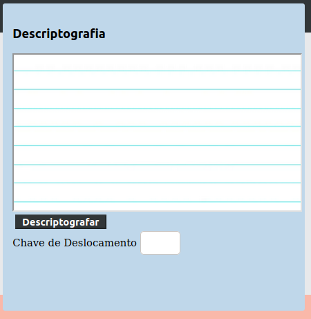

#  Diário Terapia - Projeto "Cifra de César

## Diário Terapia

A Web App "Diário Terapia" foi idealizada visando transformar a antiga prática de escrever em um papel, em tecnologia.
Existem inúmeras pesquisas, inclusive na internet, que garantem que escrever um diário pode ser uma prática terapêutica muito eficaz e barata.
Ao realizar pesquisas na internet, encontramos diversos artigos sobre seus benefícios. Exemplo:

  - Auxilia na Saúde Mental.
  - Auxilia na Saúde Mental.
  - Ajuda estabelecer planos.
  - Auxilia na Organização Pessoal.
  - Exercitar a escrita.

Enfim, são inúmeros os benefícios e vantagens! Porém, quantas pessoas se sentem inseguras em registrar informações íntimas e secretas em um papel ou em uma plataforma sem a garantia de exposição?

A origem dessa ideia vem, inclusive, de uma demanda pessoal. Recentemente, um familiar passou por uma crise psicológica, e eu decidi escrever um diário sobre situações aos quais enfrentamos durante a vida e que em algum momento possam ser usadas em tratamentos terapêuticos.

## Público-alvo

Não existem restrições para público-alvo. A ideia é trazer melhorias futuras na interface gráfica para que possa ser agradável a qualquer tipo de público. E embora o nome e a idealização esteja apontando para tratamento terapeutico
, queremos que todos possam desfrutar dos benefícios citados anteriormente.

## Como funciona atualmente?

Existe um espaço para o usuário inserir o texto a ser criptografado: 

Um espaço para resultado, a qual é compartilhado com o recurso de descriptografia. Com Menu de Chave de Deslocamento.

Espaço para o usuário inserir o texto a ser descriptografado. Com Menu de Chave de Deslocamento.

## Melhorias Futuras

A primeira fase de entrega foi concluída. Entretanto, existem muitas funcionalidades as quais ainda não foram implementadas. Exemplo:

- Recursos de melhorias na criptografia e descriptografia;
- Páginas com Instruções de uso e informativos que facilitem a interação do usuário;
- Melhorias no Designer, inclusive, pensando em acessibilidade;
- Futuramente tela de login;
- Recurso de "To do list" para adicionar, salvar, editar ou remover anotações;
- Recurso de Calendário;
- Estudar boas práticas e storytelling afim de incorporar algo mais moderno e interessante em todo contexto do site.

